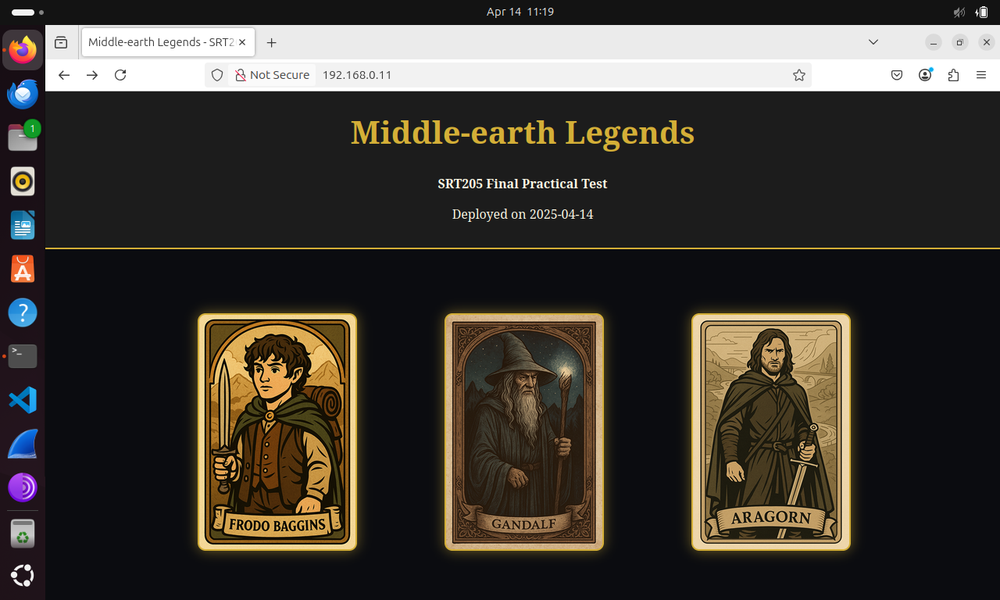

# **SRT205 Final**

### 🌐 **Picture of the Website Running on Web Server**



### 🚀 **Running the playbook and successful execution**

``` ansible-playbook -i inventory/hosts playbooks/site.yml --ask-become-pass --ask-vault-pass ```

```
PLAY [Deploy database server] **************************************************

TASK [Gathering Facts] *********************************************************
[WARNING]: Platform linux on host dbserver01 is using the discovered Python
interpreter at /usr/bin/python3.12, but future installation of another Python
interpreter could change the meaning of that path. See
https://docs.ansible.com/ansible-
core/2.18/reference_appendices/interpreter_discovery.html for more information.
ok: [dbserver01]

TASK [db_deploy : Install required packages] ***********************************
ok: [dbserver01] => (item=mysql-server)
ok: [dbserver01] => (item=python3)
ok: [dbserver01] => (item=python3-pymysql)

TASK [db_deploy : Ensure MySQL service is started and enabled] *****************
ok: [dbserver01]

TASK [db_deploy : Create MySQL database] ***************************************
ok: [dbserver01]

TASK [db_deploy : Create MySQL user with privileges] ***************************
[WARNING]: Option column_case_sensitive is not provided. The default is now
false, so the column's name will be uppercased. The default will be changed to
true in community.mysql 4.0.0.
ok: [dbserver01]

TASK [db_deploy : Copy initial SQL script] *************************************
changed: [dbserver01]

TASK [db_deploy : Import initial SQL data] *************************************
changed: [dbserver01]

TASK [db_deploy : Run SELECT query on characters] ******************************
ok: [dbserver01]

TASK [db_deploy : Show query output] *******************************************
ok: [dbserver01] => {
    "query_output.query_result": [
        [
            {
                "id": 1,
                "name": "Frodo Baggins",
                "origin": "The Shire",
                "race": "Hobbit",
                "role": "Ring-bearer",
                "specialty": "Resistance to the Ring"
            },
            {
                "id": 2,
                "name": "Gandalf",
                "origin": "Valinor",
                "race": "Maia",
                "role": "Wizard",
                "specialty": "Magic, Wisdom, Immortality"
            },
            {
                "id": 3,
                "name": "Aragorn",
                "origin": "Rivendell",
                "race": "Human",
                "role": "Ranger",
                "specialty": "Leadership, Healing"
            },
            {
                "id": 4,
                "name": "Legolas",
                "origin": "Mirkwood",
                "race": "Elf",
                "role": "Archer",
                "specialty": "Enhanced Agility, Keen Vision"
            },
            {
                "id": 5,
                "name": "Gimli",
                "origin": "Erebor",
                "race": "Dwarf",
                "role": "Warrior",
                "specialty": "Strength, Endurance"
            },
            {
                "id": 6,
                "name": "Eowyn",
                "origin": "Rohan",
                "race": "Human",
                "role": "Shieldmaiden",
                "specialty": "Bravery, Combat Prowess"
            },
            {
                "id": 7,
                "name": "Galadriel",
                "origin": "Lothlorien",
                "race": "Elf",
                "role": "Lady of Lothlorien",
                "specialty": "Wisdom, Telepathy, Light of Earendil"
            }
        ]
    ]
}

TASK [db_deploy : Clean up temporary SQL file] *********************************
changed: [dbserver01]

PLAY [Deploy web server] *******************************************************

TASK [Gathering Facts] *********************************************************
[WARNING]: Platform linux on host webserver01 is using the discovered Python
interpreter at /usr/bin/python3.12, but future installation of another Python
interpreter could change the meaning of that path. See
https://docs.ansible.com/ansible-
core/2.18/reference_appendices/interpreter_discovery.html for more information.
ok: [webserver01]

TASK [web_deploy : Install Nginx] **********************************************
ok: [webserver01]

TASK [web_deploy : Ensure Nginx is started and enabled] ************************
ok: [webserver01]

TASK [web_deploy : Create web root directory] **********************************
ok: [webserver01]

TASK [web_deploy : Copy static web files (images and styles)] ******************
ok: [webserver01] => (item={'src': 'images/aragorn.png', 'dest': 'images/aragorn.png'})
ok: [webserver01] => (item={'src': 'images/frodo.png', 'dest': 'images/frodo.png'})
ok: [webserver01] => (item={'src': 'images/gandalf.png', 'dest': 'images/gandalf.png'})
ok: [webserver01] => (item={'src': 'styles.css', 'dest': 'styles.css'})

TASK [web_deploy : Deploy index.html from Jinja2 template] *********************
ok: [webserver01]

TASK [web_deploy : Configure Nginx with final.j2] ******************************
ok: [webserver01]

TASK [web_deploy : Enable Nginx site by creating symbolic link] ****************
ok: [webserver01]

PLAY RECAP *********************************************************************
dbserver01                 : ok=10   changed=3    unreachable=0    failed=0    skipped=0    rescued=0    ignored=0   
webserver01                : ok=8    changed=0    unreachable=0    failed=0    skipped=0    rescued=0    ignored=0   
```