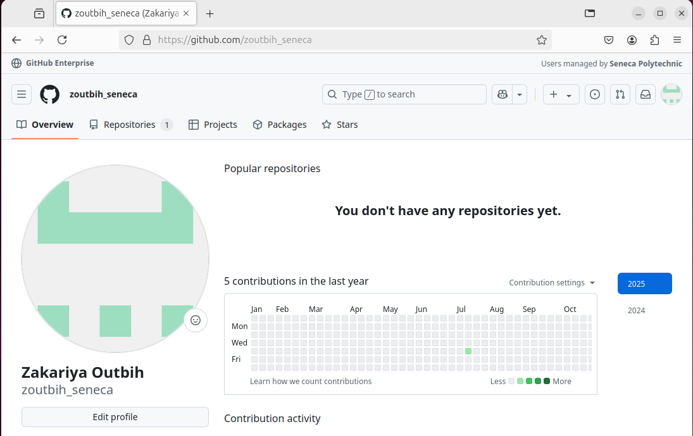
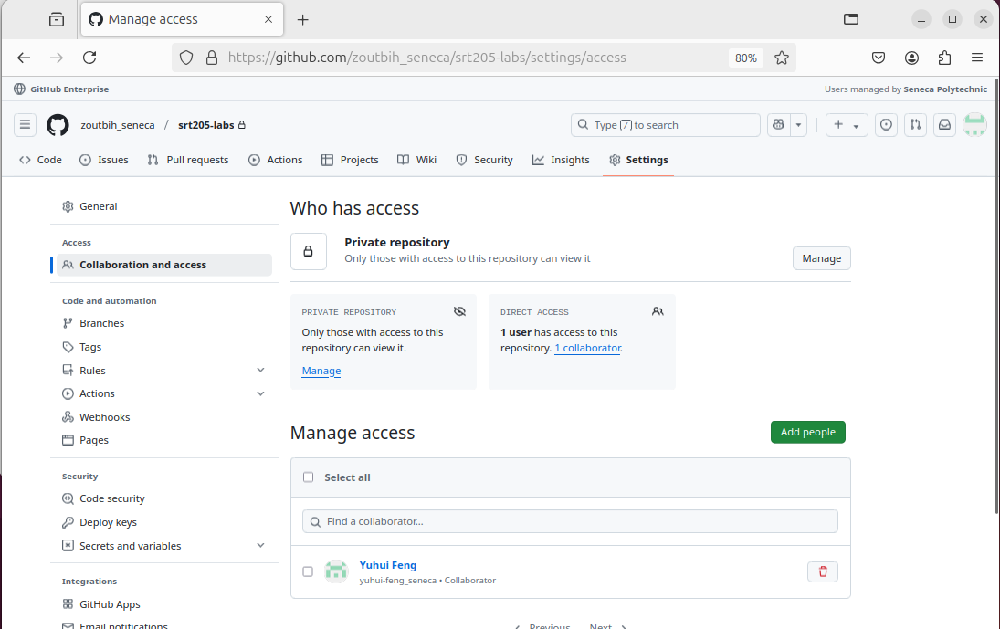
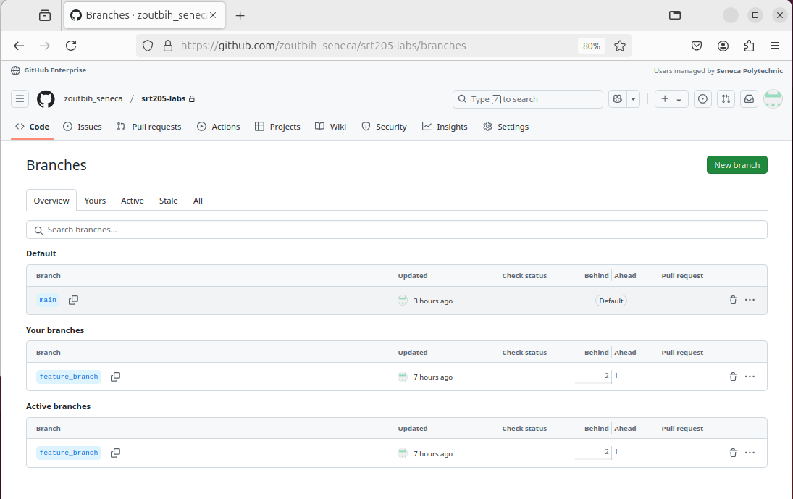

# Lab01 Introduction to git and github
**name:** Zakariya Outbih   
**Student ID:** 100184233  
**Date:** 2025/01/25

## Table of contents
- [Introduction](##Introduction)  
- [VM configuration details](##VM-Configuration-Details)
- [Deliverables](##Deliverables)
- [Experience and Challenges](##Experience-and-Challenges)


## Introduction

This lab involves setting up and installing a git repository as well as adding, commiting and pushing repositories into github.


## VM configuration details

**VM name** zubuntu  
**RAM** 4GB   
**Disk Space** 30 GB   
**CPU cores** 4  
**Network Adapter** NAT

## Deliverables

### Deliverable 1
``` lsb_release -a ```

```
No LSB modules are available.
Distributor ID:	Ubuntu
Description:	Ubuntu 24.04.1 LTS
Release:	24.04
Codename:	noble
```

### Deliverable 2

``` uname -a ```
```
Linux zak-Virtualbox 6.8.0-51-generic #52-Ubuntu SMP PREEMPT_DYNAMIC Thu Dec  5 13:09:44 UTC 2024 x86_64 x86_64 x86_64 GNU/Linux
```
### Deliverable 3



### Deliverable 4


### Deliverable 5
``` git config --list ```

```
user.name=Zakariya Outbih
user.email=zoutbih@myseneca.ca
core.repositoryformatversion=0
core.filemode=true
core.bare=false
core.logallrefupdates=true
remote.origin.url=git@github.com:zoutbih_seneca/srt205-labs.git
remote.origin.fetch=+refs/heads/*:refs/remotes/origin/*
branch.main.remote=origin
branch.main.merge=refs/heads/main
```

### Deliverable 6

``` git log ```

```
commit 4e646cbe3f2d7024a79e35d7422edaf172db32f5 (HEAD -> main, origin/main, origin/HEAD)
Author: Zakariya Outbih <zoutbih@myseneca.ca>
Date:   Wed Jan 15 15:13:21 2025 -0500

    Delete test.md

commit c2c4abbfd111946ce5cbc3e93edb55de761ecc0e
Author: Zakariya Outbih <zoutbih@myseneca.ca>
Date:   Wed Jan 15 15:10:13 2025 -0500

    this is a test

commit b2375d0bc26bebc52a1041ad17289ad94ebd19fb
Author: Zakariya Outbih <zoutbih@myseneca.ca>
Date:   Wed Jan 15 11:15:41 2025 -0500

    Initial commit
```

### Deliverable 7



## Experience and Challenges

one of the biggest challenges i faced was having two directories both named srt205-labs. This caused issues when adding commiting and pushing files and directories. The easiest fix I found was to clone the repository and move the files.
