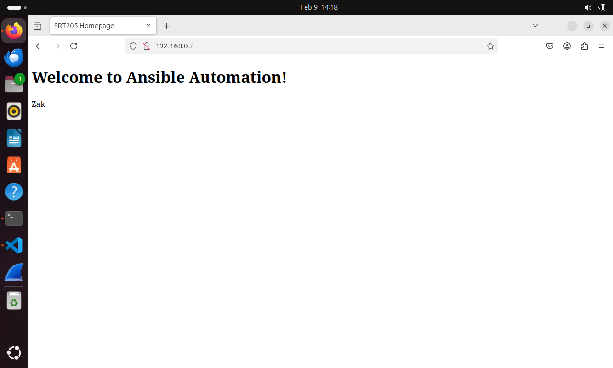

# Lab05 Writing and executing Ansible Playbooks
**name:** Zakariya Outbih   
**Student ID:** 100184233  
**Date:** 02/09/2025

## Table of contents
- [Introduction](##Introduction)  
- [VM configuration details](##VM-Configuration-Details)
- [Deliverables](##Deliverables)
- [Experience and Challenges](##Experience-and-Challenges)


## Introduction

This lab focuses on learning how to write and execute ansible playbooks. It teaches you how to follow correct formatting guidelines and how to appropriately use ansible modules in ansible playbooks.


## VM configuration details

**VM name** zubuntu (control node)
**RAM** 4GB   
**Disk Space** 25 GB   
**CPU cores** 4  
**Network Adapter** NAT && internal

**VM name** managenode01 
**RAM** 4GB   
**Disk Space** 25 GB   
**CPU cores** 4  
**Network Adapter** NAT && internal

**VM name** managenode02 
**RAM** 4GB   
**Disk Space** 25 GB   
**CPU cores** 4  
**Network Adapter** NAT && internal

## Deliverables

### Deliverable 1
``` ansible-playbook -i static_inventory_copy basic_playbook.yml ```

```
PLAY [Basic Playbook Example] **************************************************

TASK [Gathering Facts] *********************************************************
[WARNING]: Platform linux on host managed_node01 is using the discovered Python
interpreter at /usr/bin/python3.12, but future installation of another Python
interpreter could change the meaning of that path. See
https://docs.ansible.com/ansible-
core/2.17/reference_appendices/interpreter_discovery.html for more information.
ok: [managed_node01]

TASK [Ensure NGINX is installed] ***********************************************
ok: [managed_node01]

TASK [Create a directory for web content] **************************************
ok: [managed_node01]

TASK [Copy an HTML file to the web directory] **********************************
ok: [managed_node01]

TASK [Update NGINX default configuration to serve /var/www/ansible-lab] ********
ok: [managed_node01]

TASK [Reload and enable NGINX service] *****************************************
changed: [managed_node01]

TASK [Restart NGINX service] ***************************************************
changed: [managed_node01]

TASK [Install htop] ************************************************************
ok: [managed_node01]

PLAY RECAP *********************************************************************
managed_node01             : ok=8    changed=2    unreachable=0    failed=0    skipped=0    rescued=0    ignored=0  
```

### Deliverable 2

``` systemctl status nginx ```
```
● nginx.service - A high performance web server and a reverse proxy server
     Loaded: loaded (/usr/lib/systemd/system/nginx.service; enabled; preset: enabled)
     Active: active (running) since Sun 2025-02-09 13:36:18 EST; 31min ago
       Docs: man:nginx(8)
    Process: 5851 ExecStartPre=/usr/sbin/nginx -t -q -g daemon on; master_process on; (code=exited, status=0/SUCCESS)
    Process: 5854 ExecStart=/usr/sbin/nginx -g daemon on; master_process on; (code=exited, status=0/SUCCESS)
   Main PID: 5855 (nginx)
      Tasks: 3 (limit: 2277)
     Memory: 2.4M (peak: 2.7M)
        CPU: 41ms
     CGroup: /system.slice/nginx.service
             ├─5855 "nginx: master process /usr/sbin/nginx -g daemon on; master_process on;"
             ├─5856 "nginx: worker process"
             └─5857 "nginx: worker process"

Feb 09 13:36:18 managenode01-VirtualBox systemd[1]: Starting nginx.service - A high performance web server and a reverse proxy server...
Feb 09 13:36:18 managenode01-VirtualBox systemd[1]: Started nginx.service - A high performance web server and a reverse proxy server.
```
### Deliverable 3

``` screenshot of webpage created on managenode01 ```



### Deliverable 4

``` cat /var/www/ansible-lab/index.html ```

``` 
<!DOCTYPE html>
<html>
  <head>
    <title>SRT205 Homepage</title>
  </head>
  <body>
    <h1>Welcome to Ansible Automation!</h1>
    <p>Zak</p>
  </body>
</html>
```


### Deliverable 5

``` htop --version ```

```
htop 3.3.0
```

### Deliverable 6

``` cat challenge_playbook.yml ```

```
---
- name: Challenge Playbook
  hosts: managed_node01
  become: yes

  tasks:
    - name: Stop and disable NGINX service
      service:
        name: nginx
        state: stopped
        enabled: no

    - name: Install Apache web server
      apt:
        name: apache2
        state: present

    - name: Start and enable Apache service
      service:
        name: apache2
        state: started
        enabled: yes

    - name: Copy index.html to Apache web directory
      copy:
        src: index.html
        dest: /var/www/html/index.html

    - name: Backup /var/www/ansible-lab directory
      archive:
        path: /var/www/ansible-lab
        dest: /var/backups/ansible-lab-backup.tar.gz
        format: gz
```

### Deliverable 7

``` ls /var/backups ```

```
alternatives.tar.0
alternatives.tar.1.gz
ansible-lab-backup.tar.gz
apt.extended_states.0
apt.extended_states.1.gz
apt.extended_states.2.gz
apt.extended_states.3.gz
dpkg.arch.0
dpkg.arch.1.gz
dpkg.arch.2.gz
dpkg.diversions.0
dpkg.diversions.1.gz
dpkg.diversions.2.gz
dpkg.statoverride.0
dpkg.statoverride.1.gz
dpkg.statoverride.2.gz
dpkg.status.0
dpkg.status.1.gz
dpkg.status.2.gz
```


## Experience and Challenges

In this lab I learned how to create various playbooks that execute various commands. This includes installing the NGINX service, uploading an html file to run a web server and how to automate various tasks using ansible playbooks. 

### dificulties & solution:

at first I was running the static inventory file from my lab03 folder since that was the original static_inventory file. However I later copied it to my lab05 folder as the instructions asked and I stopped receiving execution errors. Additionaly I misnamed my index.html file to website.html and that caused issues with the playbook execution since in the basic_playbook.yml file, the name is specified as index.html.