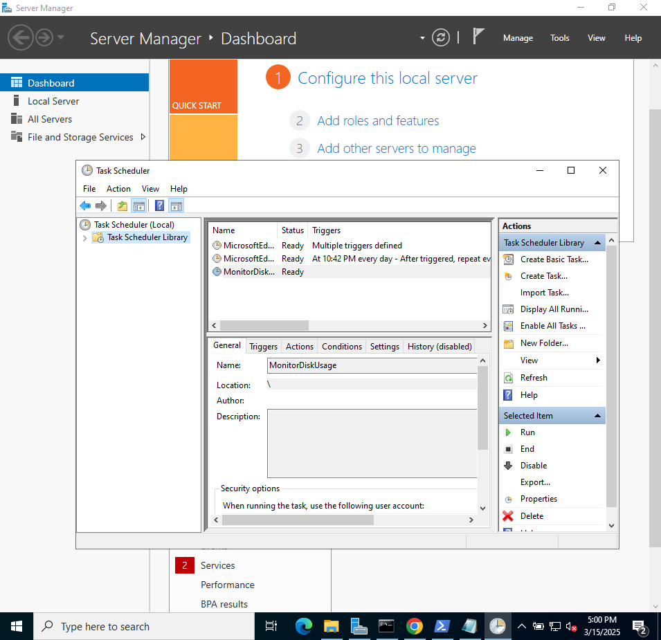

# Lab08 Managing Windows Hosts with Ansible
**name:** Zakariya Outbih   
**Student ID:** 100184233  
**Date:** 03/15/2025

## Table of contents
- [Introduction](##Introduction)  
- [VM configuration details](##VM-Configuration-Details)
- [Deliverables](##Deliverables)
- [Experience and Challenges](##Experience-and-Challenges)


## Introduction

This lab introduced me to managing and controlling a Windows managed node in Ansible. I used various Windows-specific modules such as win_service, win_chocolatey, and win_scheduled_task to automate tasks like managing services, installing software, and scheduling scripts.

## VM configuration details

**VM name** zubuntu (control node)
**RAM** 4GB   
**Disk Space** 25 GB   
**CPU cores** 4  
**Network Adapter** NAT && internal

**VM name** managenode04 
**RAM** 4GB   
**Disk Space** 80 GB   
**CPU cores** 4  
**Network Adapter** NAT && internal


## Deliverables

### Deliverable 1
``` ipconfig ```

```
Windows IP Configuration


Ethernet adapter Ethernet:

   Connection-specific DNS Suffix  . :
   IPv6 Address. . . . . . . . . . . : fd00::f5d8:594c:75b5:5bc1
   Link-local IPv6 Address . . . . . : fe80::f5d8:594c:75b5:5bc1%4
   IPv4 Address. . . . . . . . . . . : 10.0.2.15
   Subnet Mask . . . . . . . . . . . : 255.255.255.0
   Default Gateway . . . . . . . . . : fe80::2%4
                                       10.0.2.2

Ethernet adapter Ethernet 2:

   Connection-specific DNS Suffix  . :
   Link-local IPv6 Address . . . . . : fe80::2034:a32c:a9a0:2d96%5
   IPv4 Address. . . . . . . . . . . : 192.168.0.4
   Subnet Mask . . . . . . . . . . . : 255.255.255.0
   Default Gateway . . . . . . . . . :
```

### Deliverable 2

``` winrm quickconfig ```

```
WinRM service is already running on this machine.                                                                  WinRM is already set up for remote management on this computer. 
```
### Deliverable 3

``` ansible-playbook -i static_inventory windows_basics.yml ```

```
PLAY [Basic Windows Automation] ************************************************

TASK [Gathering Facts] *********************************************************
ok: [win_node01]

TASK [Check WinRM connectivity] ************************************************
ok: [win_node01]

PLAY RECAP *********************************************************************
win_node01                 : ok=2    changed=0    unreachable=0    failed=0    skipped=0    rescued=0    ignored=0    
```

### Deliverable 4

``` ansible-playbook -i static_inventory windows_automation.yml  ```

``` 
 PLAY [Automate Common Tasks on Windows] ******************************************

TASK [Gathering Facts] ***********************************************************
ok: [win_node01]

TASK [Start Spooler service] *****************************************************
ok: [win_node01]

TASK [Install Google Chrome using Chocolatey] ************************************
changed: [win_node01]

TASK [Create a folder named c:\temp_dir] *****************************************
changed: [win_node01]

PLAY RECAP ***********************************************************************
win_node01                 : ok=4    changed=2    unreachable=0    failed=0    skipped=0    rescued=0    ignored=0 
```

### Deliverable 5

``` ansible-playbook -i static_inventory advanced_playbook.yml ```

```
PLAY [Create user, assign admin rights, and deploy script on Windows] *****************

TASK [Gathering Facts] ****************************************************************
ok: [win_node01]

TASK [Create a local user account] ****************************************************
changed: [win_node01]

TASK [Grant user administrator privileges] ********************************************
changed: [win_node01]

TASK [Create a folder for the script if it doesn't exist] *****************************
ok: [win_node01]

TASK [Deploy PowerShell script to monitor disk usage] *********************************
ok: [win_node01]

TASK [Schedule PowerShell script using Task Scheduler] ********************************
ok: [win_node01]

PLAY RECAP ****************************************************************************
win_node01                 : ok=6    changed=2    unreachable=0    failed=0    skipped=0    rescued=0    ignored=0  
```


### Deliverable 6

``` Screenshot of the task scheduler in windows task scheduler ```




## Experience and Challenges

In this lab, I learned how to automate tasks on Windows using Ansible, including managing services, installing software, and creating scheduled tasks. I also explored using WinRM for remote management and the challenges that come with setting up connectivity. Additionally, I gained hands-on experience with Ansible modules like win_service, win_chocolatey, and win_scheduled_task to configure and maintain Windows systems efficiently. Overall, this lab enhanced my understanding of automating Windows management in a cross-platform environment.

### dificulties & solution:

I had difficulties when testing connectivity, I kept getting the message 

``` fatal: [win_node01]: UNREACHABLE! => {"changed": false, "msg": "ssl: auth method ssl requires a password", "unreachable": true} ```


After alote of troubleshooting I realised that I had misspelled the ansible_password field in win_node01.yml as ansible_passw0rd (with a zero). This small typo caused the entire variable file to break, preventing Ansible from recognizing the host and establishing a connection.