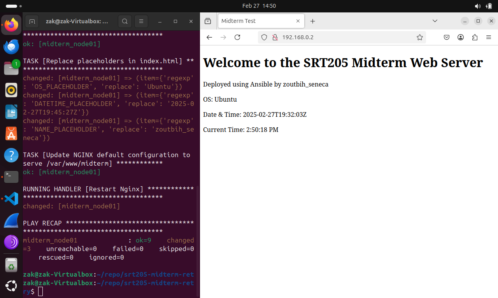

# midterm-retry 
**name:** Zakariya Outbih   
**Student ID:** 100184233  
**Date:** 02/27/2025

### running the webserver_setup.yml playbook

```  ansible-playbook -i inventory/hosts playbooks/webserver_setup.yml ```

```
PLAY [Configure web server on midterm_node01] **********************************

TASK [Gathering Facts] *********************************************************
[WARNING]: Platform linux on host midterm_node01 is using the discovered Python
interpreter at /usr/bin/python3.12, but future installation of another Python
interpreter could change the meaning of that path. See
https://docs.ansible.com/ansible-
core/2.17/reference_appendices/interpreter_discovery.html for more information.
ok: [midterm_node01]

TASK [Install Nginx] ***********************************************************
ok: [midterm_node01]

TASK [Start and enable Nginx service] ******************************************
ok: [midterm_node01]

TASK [Create web root directory] ***********************************************
ok: [midterm_node01]

TASK [Deploy web application files] ********************************************
changed: [midterm_node01] => (item=../files/index.html)
ok: [midterm_node01] => (item=../files/script.js)
ok: [midterm_node01] => (item=../files/style.css)

TASK [Check if index.html exists] **********************************************
ok: [midterm_node01]

TASK [Replace placeholders in index.html] **************************************
changed: [midterm_node01] => (item={'regexp': 'OS_PLACEHOLDER', 'replace': 'Ubuntu'})
changed: [midterm_node01] => (item={'regexp': 'DATETIME_PLACEHOLDER', 'replace': '2025-02-27T19:45:27Z'})
changed: [midterm_node01] => (item={'regexp': 'NAME_PLACEHOLDER', 'replace': 'zoutbih_seneca'})

TASK [Update NGINX default configuration to serve /var/www/midterm] ************
ok: [midterm_node01]

RUNNING HANDLER [Restart Nginx] ************************************************
changed: [midterm_node01]

PLAY RECAP *********************************************************************
midterm_node01             : ok=9    changed=3    unreachable=0    failed=0    skipped=0    rescued=0    ignored=0 
```

### screenshot of webpage running

